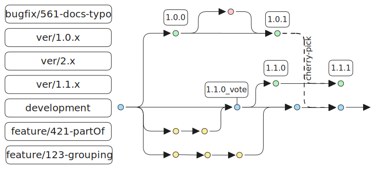

# Repository policy

## Branches

The leading branch is the `development`, from which most other branches should be created. Version branches are to be found on branches starting with `ver` for example `ver/1.1.x`. The official versions of the standard are marked with tags, for example `1.0.0`, and can be also found in [GitHub realeses](https://github.com/buildingSMART/IDS/releases). 

## Contributing

Anyone is welcome to contribute to the IDS repository. If you got an idea or problem but don't know how to solve it, simply put it on the [Issue board](https://github.com/buildingSMART/IDS/issues). If you want to contribute with changes, please create dedicated branch based of the `development`.

Depending on the nature of the change, add a prefix `feature/`, `bugfix/` or `docs/`, followed by an issue number (if exists) and descriptive name: `feature/<issue-number>-<descriptive-name>`

## Version naming

For the versions of the IDS standard, we followe the [Semantic Versioning](https://semver.org/) naming: `MAJOR.MINOR.PATCH` (example 1.2.3), where:
- MAJOR version for incompatible changes.
- MINOR version for adding functionality in a backward compatible manner.
- PATCH version for backward compatible fixes - doesn't require separate certification procedure.
